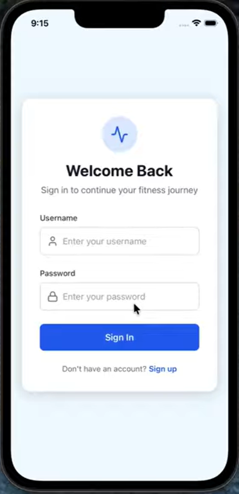

# StepUp – Mobile Fitness & Social Accountability App

StepUp is a **gamified iOS step-tracking app** built during a hackathon by a team of four former student-athletes. The app combines **fitness, competition, and social connectivity** to encourage users to stay active through daily step goals and challenges.

---

## 🎥 Demo Video
A full walkthrough of the StepUp app is available here:  
👉 https://www.youtube.com/watch?v=z_32nXzH-QE

---

## 📱 App Preview

  

---

## 🎯 Inspiration
As busy college students and former student-athletes, our team wanted a way to stay active despite packed schedules. We realized that while workouts aren’t always possible, **daily steps are achievable**. StepUp was created to merge competitive motivation with modern fitness technology, helping users stay active and connected.

---

## 🚀 What StepUp Does
StepUp encourages physical activity through **friendly competition and social accountability**.

Key features include:
- Daily step tracking with visual progress charts
- Competitive **leaderboards** and team challenges
- Friendly battles, boss challenges, and distance goals
- Account creation via email
- Messaging and external invites for social interaction

The app motivates users to move more while strengthening social connections.

---

## 🛠 How We Built It
We split into **front-end and back-end teams** to build StepUp efficiently.

### Front End
- Built with **React Native Expo** and **JavaScript**
- Developed in **VS Code**
- UI testing performed using **Xcode iOS Simulator**
- Focused on clean design, usability, and responsive screens

### Back End
- Built using **Python**, **Flask**, and **SQLAlchemy**
- Handled user accounts, step data, and challenge logic
- Integrated database functionality with the front end

After development, both sides were integrated and refined through iterative testing.

---

## 👤 My Contributions
I worked on StepUp as a **Front-End Developer** as part of a four-person hackathon team.

My contributions included:
- Designing and implementing the **user interface** using **React Native Expo** in VS Code
- Building core UI screens for step tracking, challenges, and leaderboards
- Collaborating with backend developers to integrate front-end components with app logic
- Supporting iOS testing by monitoring backend behavior through **Xcode Simulator**
- Working within a shared GitHub codebase to merge features and ensure consistent UI behavior

This project emphasized rapid prototyping, teamwork, and learning new technologies under time constraints.

---

## ⚠️ Challenges
- No prior experience with **React Native or JavaScript** at the start of the hackathon
- iOS development required **macOS + Xcode**, limiting local testing on Windows machines
- Implementing leaderboards, boss challenges, and step charts required extensive UI iteration
- An attempted integration with **Apple HealthKit** could not be finalized before the deadline

Despite these challenges, the team successfully delivered a functional and polished app.

---

## 🏆 Accomplishments
- Learned and applied **React Native Expo** from scratch under time constraints
- Delivered a **visually polished user interface**
- Built engaging fitness features that promote both **physical health and social interaction**
- Completed full front-end and back-end integration within the hackathon timeline

---

## 📚 What We Learned
- Learning new technologies quickly under pressure
- Collaborating effectively in a team-based development environment
- Debugging and iterating on mobile UI design
- Managing platform-specific development constraints

---

## ▶️ Running the Project Locally
This project targets **iOS** and requires **macOS + Xcode** to build and run.

I do not currently have access to an iOS/macOS environment, so this repository relies on:
- Source code
- Documentation
- Screenshot
- Demo video linked above

---

## 🛠 Built With
- React Native  
- React Native Expo  
- JavaScript  
- Python  
- Flask  
- SQLAlchemy  
- Git & GitHub  
- VS Code  
- Xcode  

---

## 🔗 Additional Repository
A follow-up repository created after the hackathon submission can be found here:  
https://github.com/rickpatking/stepupfinal-direct-

